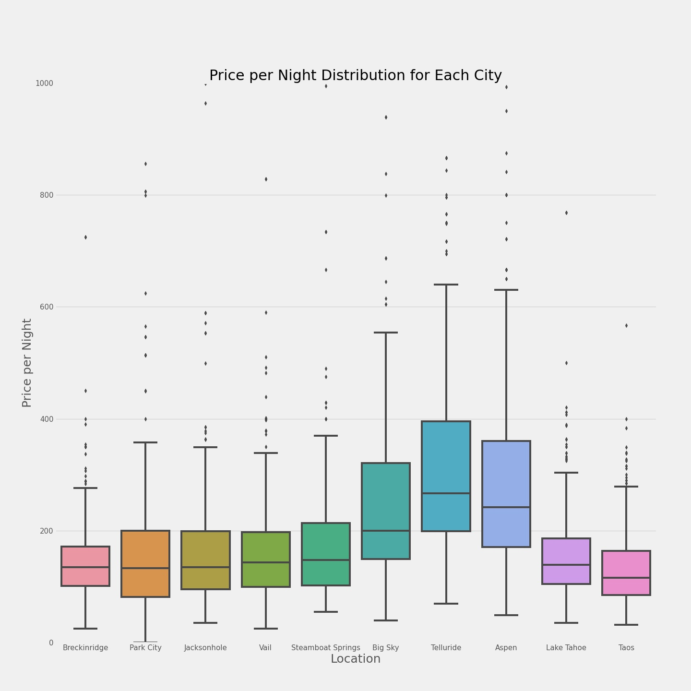

# Airbnb Ski Rental Home

    

Airbnb provides recommended pricing for a new listing based on information it gathers from other listings in a particular area and a review of customer willingness to book these listings. Hosts provide details regarding the number of guests, beds, bathrooms, location and amenities describing the property and are matched with a suggested price from Airbnb.

I have enjoyed being a customer of Airbnb for the last several years and since I am an avid skier it is my dream to one day own a home near a major ski resort. I consistently purchase the IKON pass each year but I would really like to own a home near a resort so I don't need to travel as far when I want to go skiing. The major ski resorts consistently have a very high cost of living so I am looking to purchase a home that I can Airbnb out when I am not there skiing myself, to help minimize overall costs. 

The purpose of this deep dive into the Airbnb market for homes near ski resports is to identify what features and amenities I should be looking for in a home to maximize my profit when I list my home on Airbnb. 

## The Data

Since the available Airbnb data did not contain the cities I was looking for to make my conclusion, I created a dataframe to determine where to purchase a ski home to maximize revenue. I scraped Airbnb listing pages from ten different locations. These locations were chosen based on the top ten ski resorts. I used Beautiful Soup to scrape the listings and generate a pandas data frame with 3000 rows and 19 columns. 

    

## Exploratory Data Analysis

The first question I wanted to answer was how Airbnb price per night was distributed in each of the ten locations. I created a box plot that visualized the answer to this question. 

    

The significance of this distribution is made more clear when looking at the cost of living for each of these locations. When I looked into the cost of living for each area, I found the following cost of living score:
- Breckenridge: 141.6
- Park City: 175
- Jackson Hole: 177.6
- Vail: 190.9
- Steamboat Springs: 144.8
- Big Sky: 116.7
- Telluride: 189.7
- Aspen: 290.1
- Lake Tahoe: 155.1
- Taos: 104.3

The scores are presented in relation to the national average of 100, so each of these locations are above the national average. Just by visually assessing these costs compared to the price per night Airbnb distribution, it is clear that Aspen is probably not going to give you the best return. It is almost three times the national average cost of living and the next highest cost of living is Telluride that is only two times the national average. Telluride actually has a higher median price per night on Airbnb, indicating that at least between these two resorts, Telluride would be the better of the two to purchase a home. 

    

## Random Forest

After building a random forest to predict the price of an Airbnb rental I received a root mean squared error of 118.42.

The top three features that contributed to price were number of allowed guests, number of beds and average review.

In the future I would like to remove the prices that were large outliers because I believe that contributed to the poor mean squared error. 

## References
https://medium.com/analytics-vidhya/scraping-airbnb-fe1e895bd925

https://www.bestplaces.net/cost-of-living/
